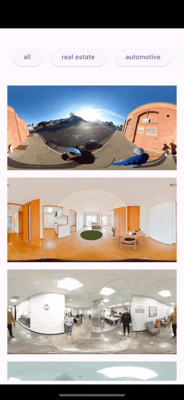
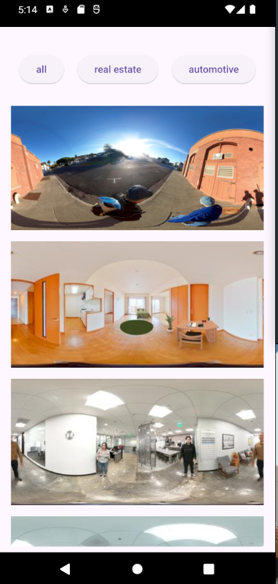

# image360mobile

Example above is on iPhone 16.

Basic example using <https://image360.oppget.com/> API.

360 image navigation and display are handled by panorama_viewer.

Android example shown above.
